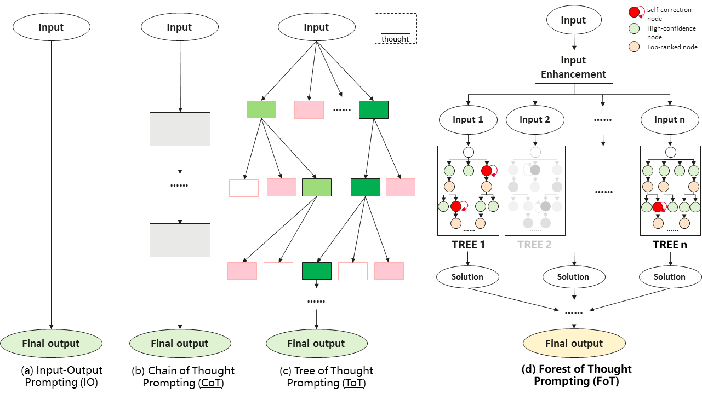

<h2><a href="https://arxiv.org/abs/2412.09078">Forest-of-Thought: Scaling Test-Time Compute for Enhancing LLM Reasoning</a></h2>

## Abstract

Large Language Models (LLMs) have demonstrated remarkable abilities across various language tasks, but solving complex reasoning problems remains a significant challenge. While existing methods, such as Chain-of-Thought (CoT) and Tree-of-Thought (ToT), enhance reasoning by decomposing problems or structuring prompts, they typically perform a single pass of reasoning and may fail to revisit flawed paths, compromising accuracy. To address this limitation, we propose a novel reasoning framework called Forest-of-Thought (FoT), which integrates multiple reasoning trees to leverage collective decision-making for solving complex logical problems. FoT employs sparse activation strategies to select the most relevant reasoning paths, improving both efficiency and accuracy. Additionally, we introduce a dynamic self-correction strategy that enables real-time error correction, along with consensus-guided decision-making strategies to optimize both correctness and computational resources. Experimental results demonstrate that the FoT framework, combined with these strategies, significantly enhances the reasoning capabilities of LLMs, enabling them to solve complex tasks with greater precision and efficiency.

<p align="center"></p>

## ⚙️Requirements and Installation

We recommend the requirements as follows.

1. **Install the required dependencies:**
   ```sh
   Python == 3.10
   CUDA Version >= 11.7
   pip install -r requirements.txt
   ```


2. **Set up a virtual environment and activate it:**

  	```shell
  	cd forest-of-thought
  	conda create -n fot python=3.10 -y
  	conda activate fot
  	```

3. **Download and set up the LLaMA model:**

    Follow the instructions provided by Hugging Face to download and set up the LLaMA model.
  
  
## 🗝️Evaluation

### Game of 24

Run experiments via ``sh scripts/game24/run.sh``,


The very simple ``run.py`` implements the FoT algorithm. Some key arguments:

- ``--correction``: Self-correction of reasoning process
- ``--tree_num``: Number of sub-trees in the forest
-  ``--prompt_sample`` (choices=[``standard``, ``cot``]): sampling prompt for IO/COT prompt
- ``--n_evaluate_sample``: number of times to prompt for state evaluation
- ``--n_select_sample``: number of states to keep from each step of subtree 
- ``--task_start_index``: The initial id of the test sample
- ``--task_end_index``: The end id of the test sample

### Benchmarks
For GSM8K,

    ```sh
    cd scripts/benchmarks
    sh eval_gsm8k.sh
    ```
For MATH,

    ```sh
    cd scripts/benchmarks
    sh eval_math500.sh
    ```
For AIME,

    ```sh
    cd scripts/benchmarks
    sh eval_aime.sh
    ```

## 👍 Acknowledgement

* [ToT](https://github.com/princeton-nlp/tree-of-thought-llm) The codebase we built upon, which serves as an efficient framework for large language inference.
* [MCTSr](https://github.com/naivoder/MCTSr) The codebase we built upon, designed as an efficient framework for large language inference.

## ✏️ Citation

```bibtex
@misc{bi2024forestofthoughtscalingtesttimecompute,
      title={Forest-of-Thought: Scaling Test-Time Compute for Enhancing LLM Reasoning}, 
      author={Zhenni Bi and Kai Han and Chuanjian Liu and Yehui Tang and Yunhe Wang},
      year={2024},
      eprint={2412.09078},
      archivePrefix={arXiv},
      primaryClass={cs.CL},
      url={https://arxiv.org/abs/2412.09078}, 
}
```
